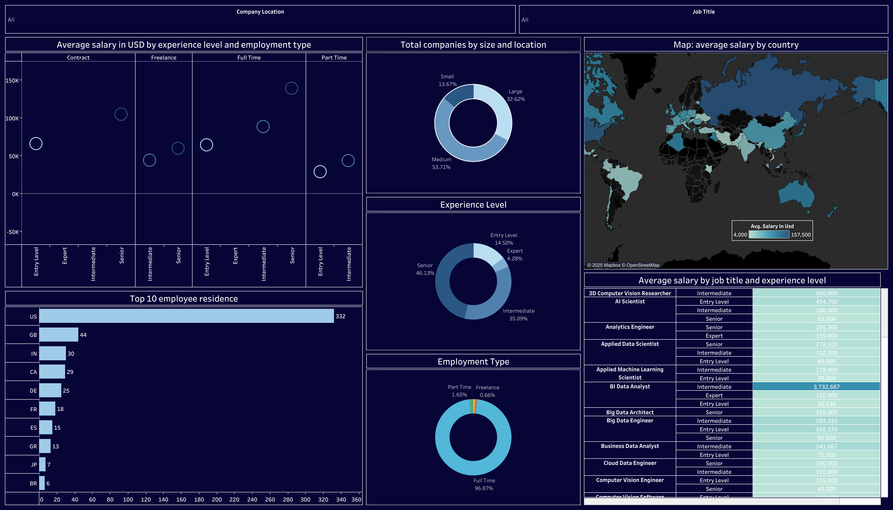

# Data Science Salary Dashboard | Tableau

## Project Overview
This project analyzes the **global data science job market** to understand salary distribution based on **job title, experience level, employment type, company size, and geographic location**.  
The interactive dashboard was built using **Tableau** to support data-driven insights for **job seekers, recruiters, and companies**.

---

## Business Questions
- How does salary vary by experience level and employment type?
- Which countries offer the highest average salaries for data roles?
- What job titles have the highest salary potential?
- How does company size impact salary distribution?
- What employment type dominates the data job market?

---

## Dataset Information
- **Source**: Data Science Salaries Dataset
- **File Format**: CSV
- **Records**: 600+ job entries
- **Data Type**: Job market and salary data
- **Time Scope**: Multi-year aggregated dataset

### Key Columns
- Job Title
- Experience Level (Entry, Intermediate, Senior, Expert)
- Employment Type (Full-Time, Part-Time, Contract, Freelance)
- Salary (USD)
- Company Size (Small, Medium, Large)
- Employee Residence
- Company Location

---

## Tools & Skills
- **Tableau**
- Data Cleaning & Preparation
- Exploratory Data Analysis (EDA)
- Data Visualization
- Dashboard Design
- Business Insight Analysis
- Salary & Job Market Analysis

---

## Dashboard Features
- **Average Salary by Experience Level & Employment Type**
- **Global Salary Map by Country**
- **Company Size Distribution**
- **Experience Level Breakdown**
- **Employment Type Distribution**
- **Top Employee Residence Countries**
- **Average Salary by Job Title & Experience Level**

---

## Key Insights
- Senior and Expert roles consistently earn higher salaries across all employment types.
- Full-time positions dominate the data job market (over 95% of total roles).
- The United States leads in both average salary and employee residence.
- Medium and large companies account for the majority of data roles.
- AI Scientist and Data Analyst roles show significant salary variation by experience level.

---

## Business Value
- Helps job seekers understand salary expectations by role and experience.
- Supports recruiters in benchmarking compensation strategies.
- Provides companies with insights into global hiring and salary trends.

---

## Dashboard Preview

---

## Repository Structure

<pre>
data-science-salary-dashboard/
├── data/
│   └── ds_salaries.csv
├── dashboard/
│   └── salary_dashboard.twb
├── images/
│   └── dashboard_preview.png
└── README.md
</pre>

---
